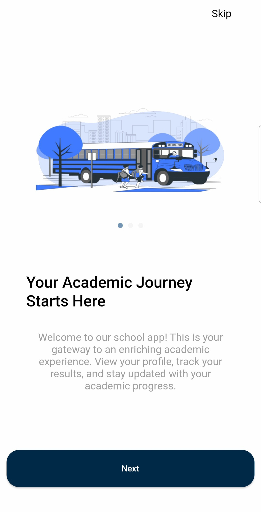
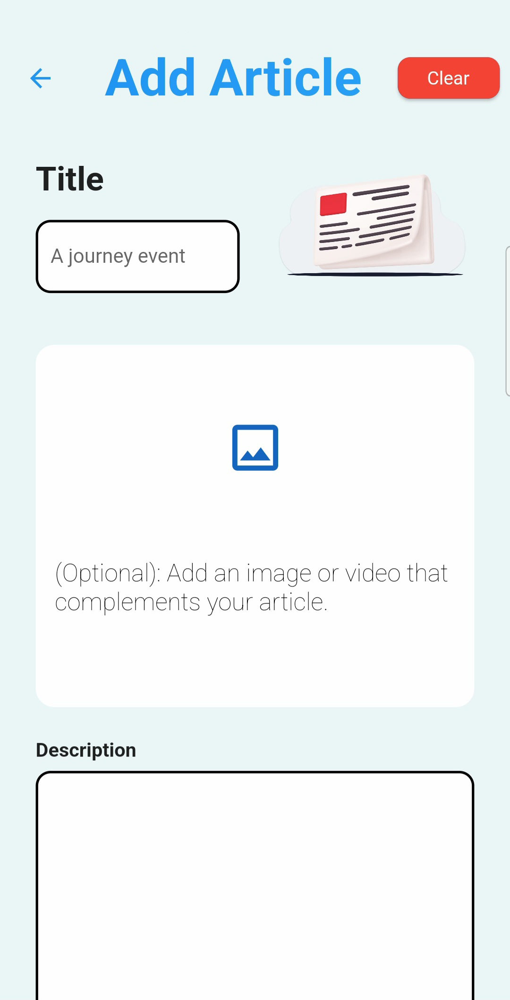

# 🔥👏 School-App

A School Mangamenet System, created with Flutter and Laravel 💻

## Getting Started

The school management system is a comprehensive web dashboard and mobile application designed to track students and their progress within the school.

Star ⭐ the repo to support the project.

## Demo

## Features

The system includes multiple user roles, including:
1) Owner
2) Admins
3) Librarian
4) Teachers
5) Parents and students.
1️⃣ Control Panel (Web)(Dashboard):
🛑 The owner, admins, and librarian all play a role in the control panel.
Owner + admins:
*Homepage:
It displays complete statistics on the number of users, in addition to financial statistics, the percentage of males and females in the school, and the latest articles.
*Register a new account:
✅Owner and admins can:
Register a new teachers, parents, students accounts.
✅Only the owner can create:
New admin or librarian account.
*Tables:
-We have a group of tables for students, parents, teachers, and admins that contain basic information about them with the ability to delete several accounts and send notifications to some of them.
*Personal inforamtion pages:
There is personal information for each account that can be modified.
*School Library:
-Manage book reservations, only the librarian can:
-Add a book (with its cover) & delete them.
*Articles:
-The admin can create articles (events - activities) and delete them,
*Courses:
-View all courses created in the school and delete them.
-Admins can add courses for any subject.
2️⃣ Mobile application (supports Android and iOS):
🛑It targets students, parents, and teachers in the school.
1- Students and parents:
-There is a profile for each student that contains complete personal information.
-Receive notifications of notes, absences, new homeworks and grades.
-Follow articles and the latest news and important events about the school.
-Both students and parents can create private conversations with teachers.
-View daily homeworks and the ability to download files if attached.
-Follow up on the latest grades from studies, exams, and grade percentages.
-The ability to browse and reserve books from the school library and confirm the request by the administration.
-View the weekly work schedule for each subject with the name of the teacher who offers this subject + view the exam programs.
-Follow the latest courses for teachers within the school and be able to reserve a seat there.
2- Teachers:
-Ability to send homeworks to students and attach help files.
-View the teacher’s work schedule.
-View the teacher’s profile, which contains his personal information.
-The ability to communicate with students and parents if they inquire about anything

## Screenshots

  
   
  

  
   
  

  
   
  

  
   
  

  
   
  

  
   
  

  
   
  

  
   
  

## Tools

- Front-end: Dart - Flutter framework
- Back-end: Php - Laravel framework
- State Management: Bloc
- Data Networking: Dio package

## Questions?🤔

Hit me on

## Contributing

This project was done By:

[@Bassam-Jawish](https://github.com/Bassam-Jawish)
[@batoul-khadamaljame](https://github.com/batoul-khadamaljame)

Pull requests are welcome.
